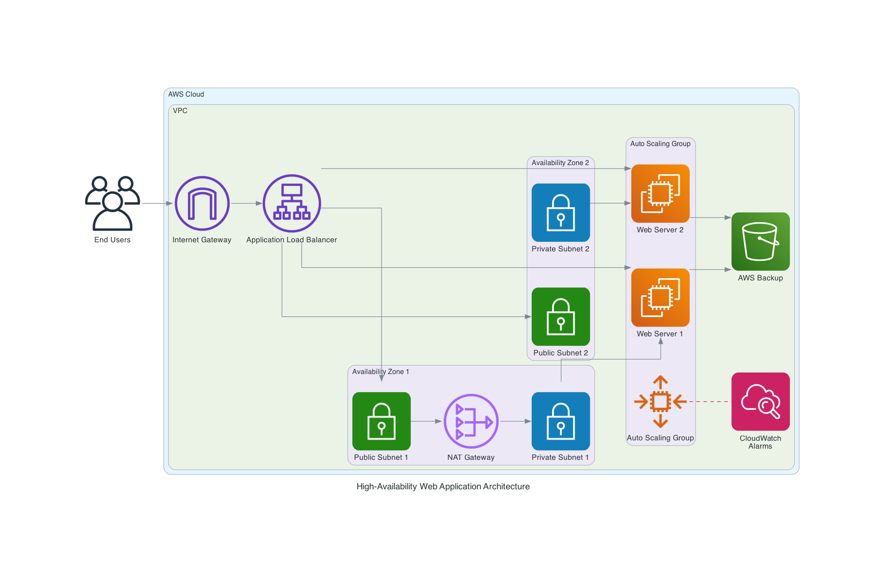

# Building a High-Availability Web Application on AWS with CDK
tags like #aws, #cloud, #devops, and #python
## Introduction

In today's cloud-first world, ensuring your applications are highly available is not just a best practice—it's a necessity. In this article, I'll walk you through how I built a high-availability web application architecture using AWS Cloud Development Kit (CDK).

This project demonstrates how to create a resilient web application infrastructure that can withstand failures and scale automatically based on demand.

## Architecture Overview

Before diving into the code, let's understand the architecture we're building:



The architecture includes:

- **VPC with public and private subnets** across two availability zones
- **Application Load Balancer (ALB)** to distribute traffic
- **Auto Scaling Group** to manage EC2 instances based on demand
- **CloudWatch** for monitoring and alerting
- **AWS Backup** for automated snapshots

## Prerequisites

To follow along, you'll need:

1. AWS CLI installed and configured
2. AWS CDK CLI installed
3. Python 3.x and pip
4. A basic understanding of AWS services

## Setting Up the Project

Let's start by setting up our project environment:

```bash
# Create a virtual environment
python3 -m venv .venv

# Activate virtual environment
source .venv/bin/activate  # Mac/Linux
# .venv\Scripts\activate  # Windows

# Install required packages
pip install -r requirements.txt
```

## Creating the VPC Infrastructure

The foundation of our high-availability architecture is a well-designed VPC. We'll create public subnets for our load balancer and private subnets for our EC2 instances.

Here's how our VPC stack is structured:

```python
# high_availability_app/vpc_stack.py
from aws_cdk import (
    Stack,
    aws_ec2 as ec2,
)
from constructs import Construct

class VpcStack(Stack):
    def __init__(self, scope: Construct, construct_id: str, **kwargs) -> None:
        super().__init__(scope, construct_id, **kwargs)
        
        # Create VPC with 2 public and 2 private subnets
        self.vpc = ec2.Vpc(
            self, "HighAvailabilityVPC",
            max_azs=2,
            nat_gateways=1,
            subnet_configuration=[
                ec2.SubnetConfiguration(
                    name="Public",
                    subnet_type=ec2.SubnetType.PUBLIC,
                    cidr_mask=24
                ),
                ec2.SubnetConfiguration(
                    name="Private",
                    subnet_type=ec2.SubnetType.PRIVATE_WITH_EGRESS,
                    cidr_mask=24
                )
            ]
        )
```

## Configuring EC2 and Auto Scaling

Next, we'll set up our EC2 instances and Auto Scaling Group:

```python
# high_availability_app/app_stack.py (simplified)
from aws_cdk import (
    Stack,
    aws_ec2 as ec2,
    aws_elasticloadbalancingv2 as elbv2,
    aws_autoscaling as autoscaling,
    aws_cloudwatch as cloudwatch,
    aws_backup as backup,
    Duration,
)
from constructs import Construct

class AppStack(Stack):
    def __init__(self, scope: Construct, construct_id: str, vpc, **kwargs) -> None:
        super().__init__(scope, construct_id, **kwargs)
        
        # Create security groups
        alb_sg = ec2.SecurityGroup(
            self, "ALBSecurityGroup",
            vpc=vpc,
            description="Security group for ALB"
        )
        alb_sg.add_ingress_rule(
            ec2.Peer.any_ipv4(),
            ec2.Port.tcp(80),
            "Allow HTTP traffic"
        )
        
        ec2_sg = ec2.SecurityGroup(
            self, "EC2SecurityGroup",
            vpc=vpc,
            description="Security group for EC2 instances"
        )
        ec2_sg.add_ingress_rule(
            alb_sg,
            ec2.Port.tcp(80),
            "Allow traffic from ALB"
        )
        
        # Create ALB
        alb = elbv2.ApplicationLoadBalancer(
            self, "WebAppALB",
            vpc=vpc,
            internet_facing=True,
            security_group=alb_sg
        )
        
        # Create listener
        listener = alb.add_listener(
            "Listener",
            port=80,
            open=True
        )
        
        # Create Auto Scaling Group
        asg = autoscaling.AutoScalingGroup(
            self, "WebAppASG",
            vpc=vpc,
            vpc_subnets=ec2.SubnetSelection(subnet_type=ec2.SubnetType.PRIVATE_WITH_EGRESS),
            instance_type=ec2.InstanceType.of(
                ec2.InstanceClass.BURSTABLE3,
                ec2.InstanceSize.MICRO
            ),
            machine_image=ec2.AmazonLinuxImage(
                generation=ec2.AmazonLinuxGeneration.AMAZON_LINUX_2
            ),
            security_group=ec2_sg,
            min_capacity=2,
            max_capacity=4,
            desired_capacity=2,
            user_data=ec2.UserData.custom(open("init_script/init_script.sh").read())
        )
        
        # Add target group to ALB
        listener.add_targets(
            "WebAppTarget",
            port=80,
            targets=[asg]
        )
        
        # Add scaling policies
        asg.scale_on_cpu_utilization(
            "CPUScaling",
            target_utilization_percent=70,
            cooldown=Duration.seconds(300)
        )
        
        # Add CloudWatch alarm
        cloudwatch.Alarm(
            self, "HighCPUAlarm",
            metric=asg.metric_cpu_utilization(),
            threshold=80,
            evaluation_periods=2,
            alarm_description="Alarm if CPU exceeds 80%"
        )
        
        # Set up AWS Backup
        backup_vault = backup.BackupVault(
            self, "WebAppBackupVault",
            backup_vault_name="WebAppBackupVault"
        )
        
        backup_plan = backup.BackupPlan(
            self, "WebAppBackupPlan"
        )
        
        backup_plan.add_rule(
            backup.BackupPlanRule(
                backup_vault=backup_vault,
                schedule_expression=events.Schedule.cron(
                    hour="3",
                    minute="0"
                ),
                delete_after=Duration.days(7)
            )
        )
        
        backup_plan.add_selection(
            "EC2Selection",
            resources=[
                backup.BackupResource.from_tag("Name", "WebAppInstance")
            ]
        )
```

## EC2 Initialization Script

Our EC2 instances need to be configured when they launch. Here's a simplified version of our initialization script:

```bash
#!/bin/bash
# init_script/init_script.sh

# Update system packages
yum update -y

# Install Apache web server
yum install -y httpd

# Start and enable Apache
systemctl start httpd
systemctl enable httpd

# Create a simple web page
cat > /var/www/html/index.html << 'EOF'
<!DOCTYPE html>
<html>
<head>
    <title>High-Availability Web App</title>
    <style>
        body {
            font-family: Arial, sans-serif;
            margin: 0;
            padding: 40px;
            background-color: #f4f4f4;
            color: #333;
            text-align: center;
        }
        .container {
            max-width: 800px;
            margin: 0 auto;
            background-color: white;
            padding: 20px;
            border-radius: 8px;
            box-shadow: 0 2px 4px rgba(0,0,0,0.1);
        }
        h1 {
            color: #0066cc;
        }
    </style>
</head>
<body>
    <div class="container">
        <h1>High-Availability Web Application</h1>
        <p>This page is served from an EC2 instance in a high-availability architecture.</p>
        <p>Instance ID: $(curl -s http://169.254.169.254/latest/meta-data/instance-id)</p>
        <p>Availability Zone: $(curl -s http://169.254.169.254/latest/meta-data/placement/availability-zone)</p>
    </div>
</body>
</html>
EOF

# Set proper permissions
chmod 644 /var/www/html/index.html
```

## Deploying the Application

With our code in place, we can now deploy our application:

```bash
# Synthesize CloudFormation template
cdk synth

# Deploy the stack
cdk deploy
```

## Testing High Availability

After deployment, we can test our high-availability setup by:

1. Accessing the ALB URL to verify the web application is running
2. Terminating an EC2 instance to see if the ALB routes traffic to the remaining instance
3. Generating load to trigger auto-scaling

## Monitoring and Alerts

Our setup includes CloudWatch alarms that will notify us if CPU utilization exceeds 80%. This helps us stay ahead of potential performance issues.

## Backup and Recovery

We've configured AWS Backup to take daily snapshots of our EC2 instances. In case of data corruption or accidental deletion, we can quickly restore our instances.

## Cost Optimization

To optimize costs while maintaining high availability:

1. Use t3.micro instances for development environments
2. Set appropriate auto-scaling thresholds
3. Consider using Spot Instances for non-critical workloads
4. Review and delete unused resources regularly

## Conclusion

Building a high-availability web application on AWS doesn't have to be complicated. With AWS CDK, we can define our infrastructure as code, making it repeatable and maintainable.

This architecture provides:

- **Fault tolerance** across multiple availability zones
- **Scalability** through auto-scaling
- **Monitoring** with CloudWatch
- **Backup and recovery** capabilities

The complete code for this project is available on GitHub. Feel free to adapt it to your specific requirements!

## Next Steps

To further enhance this architecture, consider:

1. Adding a custom domain with Route 53
2. Implementing HTTPS with AWS Certificate Manager
3. Setting up a CI/CD pipeline for automated deployments
4. Adding a database layer with Amazon RDS

Happy cloud architecting!
